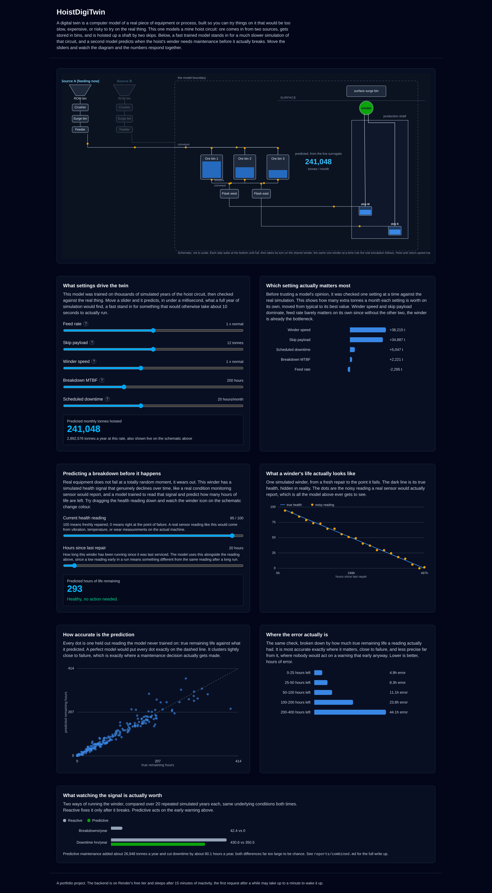
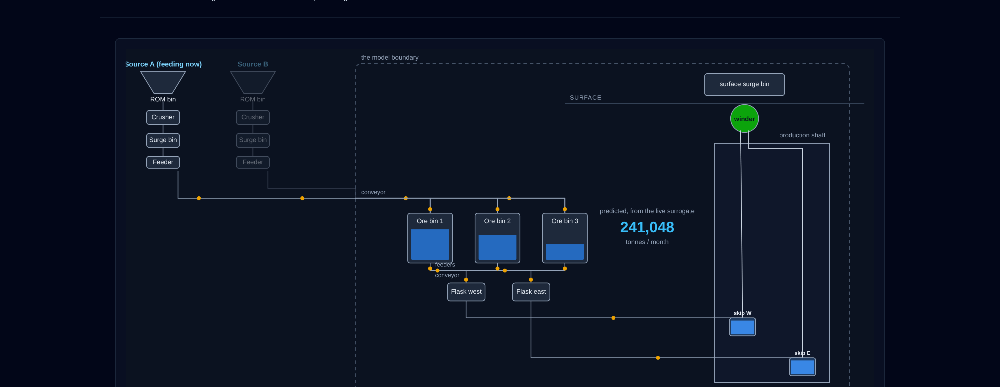
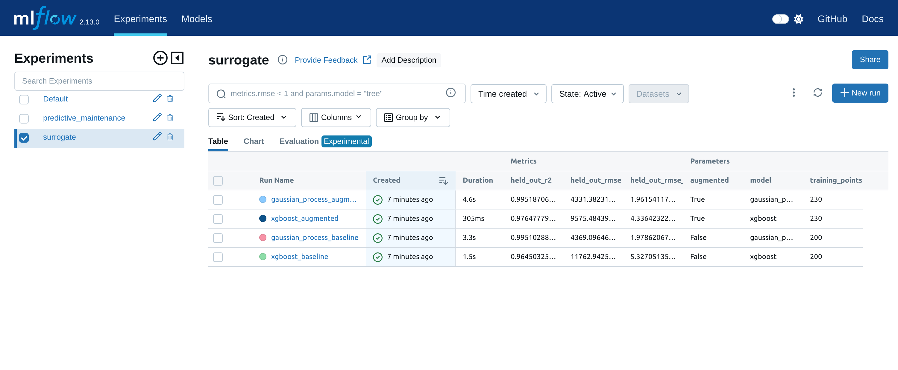

# HoistDigiTwin

A digital twin of a mine hoist circuit, built end to end: a discrete event
simulation of the physical process, a fast machine learning surrogate that
stands in for it, an optimisation search over that surrogate, a predictive
maintenance model that learns to predict a breakdown before it happens, and
a public dashboard that ties all of it together. Every number this project
reports is checked against something, either the real simulation or data
the model never trained on, not just asserted.

**Try it live:** [hoistdigitwin-frontend.onrender.com](https://hoistdigitwin-frontend.onrender.com)
(hosted free, the backend sleeps after 15 minutes idle, the first request
after a while can take up to a minute to wake it up)



## What this actually models

Two ore sources feed a shared conveyor, one active at a time. That
conveyor fills three ore bins, which feed two flasks, which load two
skips. The skips share a single winder, hoisting ore up a shaft to a
surface bin. Only one skip can be hoisted, dumped, or returned at a time,
since there is only one winder, so the other skip loads while it waits its
turn, the actual efficiency reason a twin skip system exists.



The dashboard's schematic runs this same rule live: a skip only leaves the
bottom once it is full and the winder is free, exactly like
`src/twin/components.py`'s own `Skip.run`.

## How the pieces connect

```
config.yaml
    |
    v
discrete event simulation (SimPy)  <-- the twin's core, src/twin/
    |
    | (thousands of runs, sampled across operating settings)
    v
surrogate model (XGBoost / Gaussian process)  <-- src/surrogate/
    |
    +---> optimisation search (random search, Bayesian optimisation)
    |     answers: which operating settings hoist the most ore
    |
    +---> served live behind the dashboard, sub-millisecond predictions

NASA C-MAPSS turbofan data  ->  remaining useful life models  <-- src/pdm/
                                        |
                                        v
        the same technique, applied to the twin's own simulated
        winder health signal  <-- src/twin/maintenance_model.py
                                        |
                                        v
        reactive vs predictive maintenance policy, compared inside
        the twin itself, many replications, common random numbers
                                        |
                                        v
                    served live behind the dashboard
```

## Headline results

Every number below is either checked against the real simulation, or
computed on data a model never trained on. See the linked report or
notebook for the full reasoning behind each one.

| Question | Result |
|---|---|
| Does the simulation match a believable year of production? | Yes. All 12 months land within 5% of a synthetic, research grounded reference year, mean monthly tonnes 212,739 with a tight confidence interval. [Report](reports/simulation_validation.md) |
| How much faster is the surrogate than the real simulation? | About 10 seconds down to under a millisecond, a fast enough stand in to search or serve live. [Notebook](notebooks/03_surrogate.ipynb) |
| How accurate is the surrogate? | The Gaussian process, the one actually deployed, is off by about 2% on settings it never trained on. [Notebook](notebooks/03_surrogate.ipynb) |
| How much does optimising the settings actually buy? | About 80% more tonnes a month, checked against the real simulation at the found optimum, not just the surrogate's own opinion. [Notebook](notebooks/04_optimise.ipynb) |
| How accurate is the remaining life prediction, on real jet engine data? | Best model (a small LSTM) has an RMSE of about 15 cycles on engines it never saw, clearly ahead of a linear baseline's 22. [Notebook](notebooks/05_predictive_maintenance.ipynb) |
| What does predictive maintenance actually buy, on the twin's own equipment? | About 26,948 more tonnes a year and 80 fewer downtime hours a year, compared to fixing the winder only after it breaks, both differences far too large to be chance (p < 0.001). [Report](reports/combined.md) |

## Experiment tracking

Every model comparison in the results table above (surrogate models, remaining
life models) is also logged to MLflow, so the parameters and metrics for every
run sit in one place instead of only living inside each phase's notebook.



This is the `surrogate` experiment: four runs, one row per model type
(XGBoost, Gaussian process) on each of the two training sets from phases 3
and 4. The Gaussian process is the one actually deployed behind the
dashboard, and its `held_out_rmse` here is the same held out error the
headline results table quotes. A second experiment, `predictive_maintenance`,
logs the same three RUL models from phase 5 the same way.

To reproduce it locally:

```
python track_experiments.py
mlflow ui
```

Then open `http://127.0.0.1:5000`. Runs are stored under `mlruns/`, which is
gitignored, so this is local only, nothing here changes what the dashboard
serves.

## Project layout

```
config.yaml               all the twin's operating assumptions in one place
src/twin/                 the discrete event simulation and its scenarios
src/surrogate/            training data generation, models, the search
src/pdm/                  the NASA C-MAPSS remaining life models
src/serve/                the FastAPI backend behind the dashboard
frontend/                 the React dashboard
models/                   the two trained models the dashboard actually serves
notebooks/                one notebook per phase, the full reasoning and results
reports/                  written findings in plain language
tests/                    pytest, one file per phase's own code
render.yaml               deploys both the backend and frontend on Render
```

## Running it yourself

### Requirements

Python 3.11, Node.js 20 or later.

### The simulation, surrogate, and predictive maintenance work

```
python3.11 -m venv .venv
source .venv/bin/activate
pip install -r requirements.txt
```

The NASA C-MAPSS FD001 dataset is not included in this repository (`data/`
is gitignored). To reproduce Phase 5's notebook, download the FD001 files
(`train_FD001.txt`, `test_FD001.txt`, `RUL_FD001.txt`, and the readme) from
the NASA Prognostics Data Repository and place them in `data/raw/`.
Everything else needs no external data, it generates its own.

Run the notebooks in order, 01 through 06, each is a self contained
walkthrough of that phase with the reasoning inline:

```
jupyter nbconvert --to notebook --execute --inplace notebooks/0*.ipynb
```

Run the tests:

```
pytest tests/
```

### The dashboard, locally

```
# backend
PYTHONPATH=src uvicorn serve.api:app --reload

# frontend, in a separate terminal
cd frontend
npm install
npm run dev
```

The frontend talks to `http://127.0.0.1:8000` by default. Both the
surrogate and the winder health model it serves are already committed
under `models/`, generated by `python src/serve/export_models.py`, so no
training is needed to run the dashboard itself.

### Deploying it

`render.yaml` at the repo root is a Render blueprint that creates both
services, a free web service for the backend and a free static site for
the frontend, in one step. On [render.com](https://render.com), choose
**New +** then **Blueprint**, connect a fork of this repository, and
Render reads `render.yaml` and sets both up.

## What is real and what is invented

This is a portfolio project, not a real mine's data. There is no access to
real historical tonnage, breakdown, or sensor records, so every physical
parameter in `config.yaml` and every dataset the twin generates itself is
either grounded in published figures for comparable equipment (cited in
[reports/simulation_validation.md](reports/simulation_validation.md)) or a
clearly documented, invented assumption. The one exception is Phase 5's
predictive maintenance work, which trains and evaluates on NASA's own
public C-MAPSS turbofan dataset, real data, on an unrelated machine, used
to learn the technique honestly before applying it to the twin itself in
Phase 6.

## Tech stack

SimPy (simulation), scikit-learn, XGBoost, and PyTorch (models), MLflow
(experiment tracking), FastAPI (backend), React and Vite (frontend), pytest,
and Jupyter for the walkthroughs.
